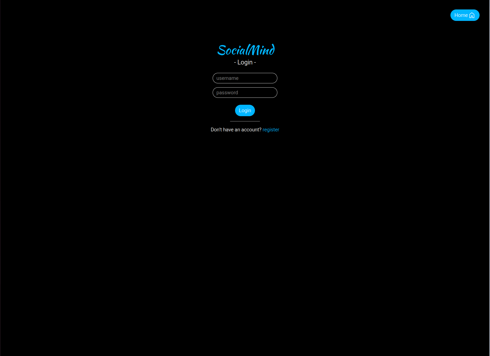
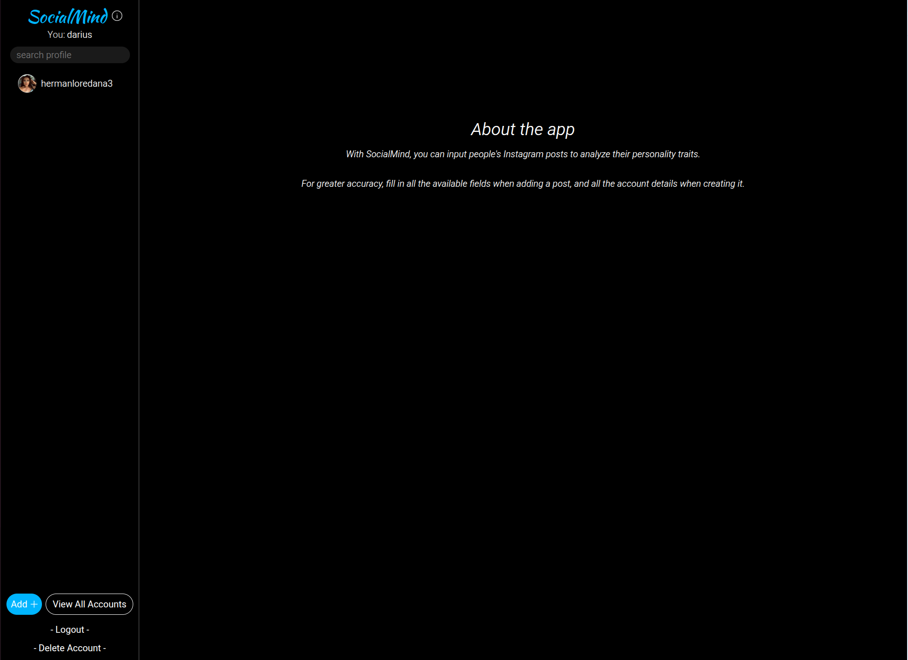
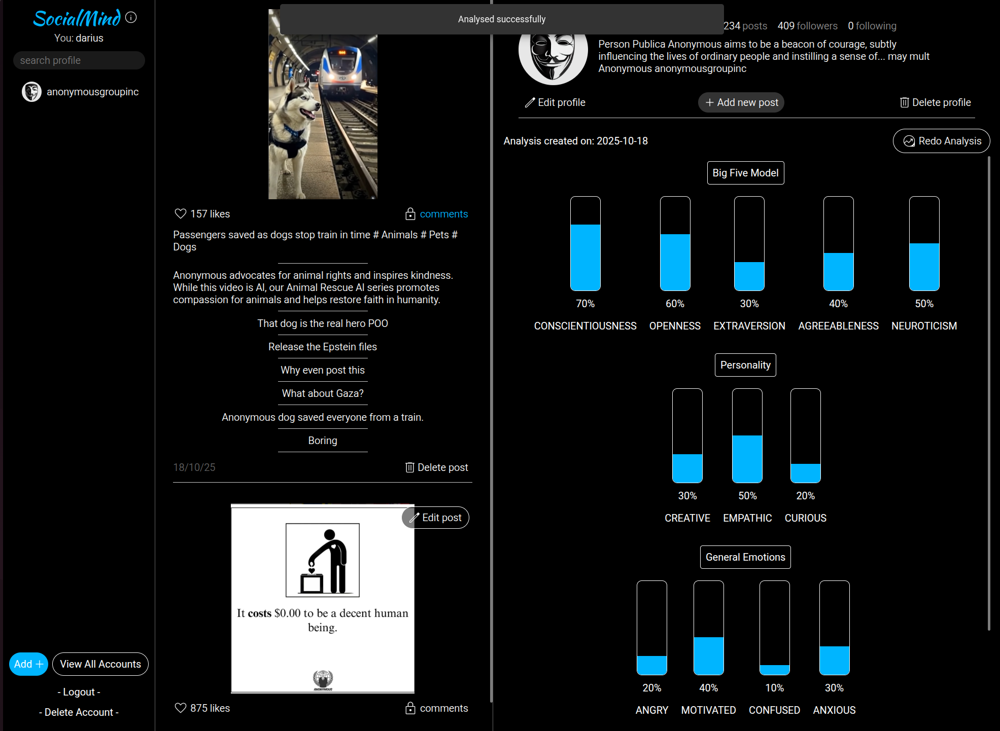

# SocialMind - Frontend

**SocialMind** is a web platform where users can upload information about Instagram accounts to receive a detailed personality analysis. The interface is intuitive and fully responsive, allowing it to be used on both desktop and mobile devices.

## Used Technologies

The user interface is built using a modern set of technologies from the JavaScript ecosystem:

* **Library:** React
* **UI Toolkit:** Ionic
* **Design & Layout:** CSS, Google Material Symbols
* **Hooks used:** `useReducer`, `useCallback`, `useRef`, `useContext`, `useState`, etc.
* **Local storage:** Capacitor Preferences for persisting the authentication token.
* **Backend communication:**
    * REST API calls to FastAPI server using `axios`.
    * WebSocket for realtime updates.

## Principal functionalities

* **Intuitive Interface**: A clean and easy-to-use design, inspired by the Instagram application, for a familiar experience.
* **Flexible Data Input**: Users can add accounts via: 
    * **Screenshot Upload**: Data is extracted automatically by the backend.
    * **Manual Entry**: An alternative for filling in or correcting information.
* **Account Viewing**: Displays the analyzed accounts in an interface similar to Instagram's, allowing the viewing of profiles and posts.
* **Personality Analysis Display**: Presents the analysis results clearly and structured, including: 
    * Big Five (OCEAN) scores.
    * Identified areas of interest and hobbies.
    * Personality type (e.g., extroverted/introverted) and dominant emotions.
* **Responsive Design**: The application automatically adapts to any screen size, providing an optimal experience on desktops, tablets, and mobile phones.
* **Persistent Session**: Keeps the user authenticated between sessions by securely storing the JWT token in Capacitor Preferences.
* **Real-time Updates**: Displayed data is automatically updated via WebSockets when changes are made, without requiring a page reload.

## Images with the app interface:
### Login page

### About page:

###  AccountDetails page
